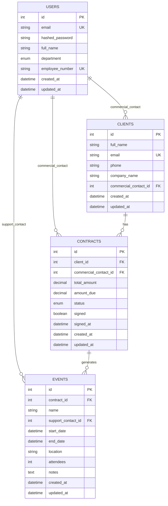

# Epic Events CRM


Application de gestion de la relation client (CRM) pour Epic Events, une entreprise d'organisation d'événements. Ce système permet de gérer l'ensemble du cycle de vie des clients, contrats et événements avec un système de permissions robuste basé sur les départements.

## 📋 Table des matières

- [Installation](#-installation)
- [Schéma de la base de données](#-schéma-de-la-base-de-données)
- [Architecture MVC](#-architecture-mvc)
- [Présentation de l'application](#-présentation-de-lapplication)
- [Tests](#-tests)
- [Monitoring avec Sentry](#-monitoring-avec-sentry)

## 🚀 Installation

### Prérequis

- Python 3.9 ou supérieur
- Git

### Étapes d'installation

1. **Cloner le projet**
```bash
git clone https://github.com/fkruklyaramis/OC_projet12.git
cd OC_projet12
```

2. **Créer un environnement virtuel**
```bash
python -m venv env
source env/bin/activate  # Linux/macOS
# ou
env\Scripts\activate     # Windows
```

3. **Installer les dépendances**
```bash
pip install -r requirements.txt
```

4. **Configurer l'environnement**
```bash
cp .env.example .env
# Éditer le fichier .env avec vos configurations
```

5. **Initialiser la base de données**
```bash
python epicevents.py init
```

6. **Première connexion**
```bash
python epicevents.py login --email admin@epicevents.com
# Mot de passe : Admin123!
```

### Variables d'environnement

Créez un fichier `.env` avec les variables suivantes :

```env
DATABASE_URL=sqlite:///./epic_events.db
SENTRY_DSN=your_sentry_dsn_here
SENTRY_ENVIRONMENT=development
SECRET_KEY=epic-events-secret-key-change-in-production
```

## 🗄️ Schéma de la base de données

### Diagramme ERD (Entity-Relationship Diagram)



### Relations et contraintes

#### 1. Relations principales

- **User → Client** (1:N) : Un commercial gère plusieurs clients
- **User → Contract** (1:N) : Un commercial gère plusieurs contrats
- **User → Event** (1:N) : Un support peut être assigné à plusieurs événements
- **Client → Contract** (1:N) : Un client peut avoir plusieurs contrats
- **Contract → Event** (1:N) : Un contrat peut générer plusieurs événements

#### 2. Contraintes métier

- **Intégrité départementale** : Seuls les commerciaux peuvent être assignés aux clients/contrats
- **Support assignment** : Seuls les supports peuvent être assignés aux événements
- **Contrat signé** : Un événement ne peut être créé que pour un contrat signé
- **Unicité** : Emails uniques pour users et clients, numéros employés uniques

#### 3. Énumérations

```python
class Department(enum.Enum):
    COMMERCIAL = "commercial"
    SUPPORT = "support"
    GESTION = "gestion"

class ContractStatus(enum.Enum):
    DRAFT = "draft"
    SIGNED = "signed"
    CANCELLED = "cancelled"
```

## 🏗️ Architecture MVC

Epic Events CRM implémente le pattern **Model-View-Controller (MVC)** pour une séparation claire des responsabilités :

### 📁 Structure du projet

```
src/
├── models/              # Model - Modèles de données
│   ├── user.py         # Modèle User avec relations
│   ├── client.py       # Modèle Client
│   ├── contract.py     # Modèle Contract
│   └── event.py        # Modèle Event
├── controllers/         # Controller - Logique métier
│   ├── base_controller.py      # Contrôleur de base avec permissions
│   ├── user_controller.py      # Gestion des utilisateurs
│   ├── client_controller.py    # Gestion des clients
│   ├── contract_controller.py  # Gestion des contrats
│   └── event_controller.py     # Gestion des événements
├── views/              # View - Interface utilisateur
│   ├── auth_view.py    # Vue d'authentification
│   ├── user_view.py    # Vue utilisateurs
│   ├── client_view.py  # Vue clients
│   ├── contract_view.py # Vue contrats
│   └── event_view.py   # Vue événements
├── services/           # Services
│   └── logging_service.py # Service de logging Sentry
├── utils/              # Utilitaires
│   ├── auth_utils.py   # Authentification et permissions
│   ├── jwt_utils.py    # Gestion JWT
│   ├── hash_utils.py   # Hachage des mots de passe
│   └── validators.py   # Validations métier
└── database/           # Configuration DB
    ├── connection.py   # Connexion SQLAlchemy
    └── init_db.py      # Initialisation et données d'exemple
```

### 🔄 Flux MVC

```
CLI Command → View → Controller → Model → Database
     ↓           ↓        ↓         ↓
  epicevents.py → *_view.py → *_controller.py → models/*.py → SQLite
```

#### Model (Modèles)
- **Responsabilité** : Définition des structures de données et logique métier
- **Technologies** : SQLAlchemy ORM, relations bidirectionnelles
- **Fonctionnalités** : Propriétés calculées, validations, cascade

#### View (Vues)
- **Responsabilité** : Interface utilisateur et présentation des données
- **Technologies** : Rich (affichage coloré), Click (CLI)
- **Fonctionnalités** : Tableaux formatés, formulaires interactifs, messages

#### Controller (Contrôleurs)
- **Responsabilité** : Logique métier et orchestration
- **Technologies** : Système de permissions, validations
- **Fonctionnalités** : CRUD operations, contrôles d'accès, gestion d'erreurs

### 🛡️ Avantages de cette architecture

1. **Séparation des responsabilités** : Chaque couche a un rôle spécifique
2. **Maintenabilité** : Code organisé et facile à modifier
3. **Testabilité** : Chaque composant peut être testé indépendamment
4. **Extensibilité** : Ajout facile de nouvelles fonctionnalités
5. **Réutilisabilité** : Composants réutilisables entre modules

## 🎯 Présentation de l'application

### 🔐 Système d'authentification

#### Authentification JWT
- **Tokens sécurisés** : JWT avec expiration (8 heures)
- **Stockage local** : Fichier `.current_user` chiffré
- **Gestion des sessions** : Login/logout automatique

#### Commandes d'authentification
```bash
# Connexion
python epicevents.py login --email user@example.com

# Statut de connexion
python epicevents.py status

# Utilisateur actuel
python epicevents.py whoami

# Déconnexion
python epicevents.py logout
```

### 👥 Système de permissions

#### Départements et rôles

| Département | Permissions | Responsabilités |
|-------------|-------------|----------------|
| **GESTION** | Accès complet | Administration système, gestion des utilisateurs |
| **COMMERCIAL** | CRUD clients/contrats assignés | Prospection, négociation contrats |
| **SUPPORT** | Modification événements assignés | Organisation et suivi événements |

#### Matrice des permissions

| Action | GESTION | COMMERCIAL | SUPPORT |
|--------|---------|------------|---------|
| Créer utilisateur | ✅ | ❌ | ❌ |
| Créer client | ✅ | ✅ (assigné) | ❌ |
| Créer contrat | ✅ | ✅ (ses clients) | ❌ |
| Créer événement | ✅ | ✅ (contrats signés) | ❌ |
| Modifier événement | ✅ | ❌ | ✅ (assignés) |
| Assigner support | ✅ | ❌ | ❌ |

### 📊 Modules et fonctionnalités

#### 1. 👤 Gestion des utilisateurs

**Fonctionnalités :**
- CRUD complet des collaborateurs
- Gestion des départements
- Changement de mots de passe
- Recherche et filtrage

**Commandes principales :**
```bash
python epicevents.py user list                    # Lister tous
python epicevents.py user list --department commercial # Filtrer par département
python epicevents.py user create                  # Créer utilisateur
python epicevents.py user update 1                # Modifier utilisateur
python epicevents.py user delete 1                # Supprimer utilisateur
python epicevents.py user password               # Changer son mot de passe
python epicevents.py user search                 # Recherche interactive
```

#### 2. 🏢 Gestion des clients

**Fonctionnalités :**
- Prospection et suivi clients
- Assignment automatique aux commerciaux
- Historique des interactions
- Recherche avancée

**Commandes principales :**
```bash
python epicevents.py client list                 # Tous les clients
python epicevents.py client list --mine          # Mes clients (commercial)
python epicevents.py client create               # Nouveau client
python epicevents.py client update 1             # Modifier client
python epicevents.py client view 1               # Détails client
python epicevents.py client assign 1 2           # Assigner à commercial
python epicevents.py client search               # Recherche
```

#### 3. 📋 Gestion des contrats

**Fonctionnalités :**
- Cycle de vie contrat (draft → signed → cancelled)
- Suivi des paiements
- Génération d'événements
- Reporting financier

**Commandes principales :**
```bash
python epicevents.py contract list               # Tous les contrats
python epicevents.py contract mine               # Mes contrats
python epicevents.py contract unsigned           # Contrats non signés
python epicevents.py contract unpaid             # Impayés
python epicevents.py contract create 1           # Nouveau contrat
python epicevents.py contract update 1           # Modifier
python epicevents.py contract sign 1             # Signer contrat
python epicevents.py contract view 1             # Détails
```

#### 4. 🎉 Gestion des événements

**Fonctionnalités :**
- Planification et organisation
- Assignment des équipes support
- Suivi temps réel
- Gestion logistique

**Commandes principales :**
```bash
python epicevents.py event list                  # Tous les événements
python epicevents.py event mine                  # Mes événements
python epicevents.py event upcoming              # À venir (30 jours)
python epicevents.py event upcoming --days 7     # À venir (7 jours)
python epicevents.py event unassigned            # Sans support
python epicevents.py event create 1              # Nouvel événement
python epicevents.py event update 1              # Modifier
python epicevents.py event assign 1 3            # Assigner support
python epicevents.py event view 1                # Détails
python epicevents.py event search                # Recherche
```

### 🔧 Modules utilitaires

#### 1. `auth_utils.py` - Authentification et permissions
```python
class PermissionChecker:
    """Vérification des permissions basée sur les départements"""
    
    def has_permission(self, user: User, permission: str) -> bool
    def can_access_resource(self, user: User, resource, action: str) -> bool
    def get_user_permissions(self, user: User) -> List[str]
```

#### 2. `jwt_utils.py` - Gestion des tokens JWT
```python
class JWTManager:
    """Gestion des tokens d'authentification"""
    
    def create_token(self, user_id: int) -> str
    def verify_token(self, token: str) -> dict
    def save_token(self, token: str) -> None
    def load_token(self) -> str
    def clear_token(self) -> None
```

#### 3. `hash_utils.py` - Sécurité des mots de passe
```python
def hash_password(password: str) -> str:
    """Hachage sécurisé avec Argon2"""

def verify_password(password: str, hashed: str) -> bool:
    """Vérification mot de passe"""
```

#### 4. `validators.py` - Validations métier
```python
class ValidationError(Exception):
    """Exception pour erreurs de validation"""

class Validator:
    """Validations des données métier"""
    
    @staticmethod
    def validate_email(email: str) -> bool
    def validate_amount(amount: Decimal) -> bool
    def validate_date_range(start: datetime, end: datetime) -> bool
```

### 🔧 Services

#### `logging_service.py` - Service de logging avec Sentry

**Fonctionnalités :**
- Monitoring en temps réel
- Journalisation des événements métier
- Gestion des erreurs et exceptions
- Contexte utilisateur

**Architecture Singleton :**
```python
class SentryLogger(Singleton):
    """Service de logging centralisé avec Sentry"""
    
    def log_authentication_attempt(self, email: str, success: bool, ip: str)
    def log_user_creation(self, created_user: User, creator: User)
    def log_contract_signature(self, contract: Contract, signer: User)
    def log_exception(self, exception: Exception, context: dict = None)
    def set_user_context(self, user: User)
    def force_flush(self)  # Envoi forcé des données
```

### 💾 Modèles de données

#### 1. **User** - Utilisateurs système
```python
class User(Base):
    """Modèle utilisateur avec départements et permissions"""
    
    # Propriétés calculées
    @property
    def is_commercial(self) -> bool
    def is_support(self) -> bool
    def is_management(self) -> bool
    
    # Relations
    clients_as_commercial: List[Client]
    contracts_as_commercial: List[Contract]
    events_as_support: List[Event]
```

#### 2. **Client** - Clients et prospects
```python
class Client(Base):
    """Modèle client avec suivi commercial"""
    
    # Propriétés métier
    @property
    def has_signed_contracts(self) -> bool
    def total_contract_amount(self) -> Decimal
    
    # Relations
    commercial_contact: User
    contracts: List[Contract]
```

#### 3. **Contract** - Contrats et devis
```python
class Contract(Base):
    """Modèle contrat avec cycle de vie"""
    
    # Propriétés calculées
    @property
    def is_fully_paid(self) -> bool
    def can_create_event(self) -> bool
    def payment_percentage(self) -> float
    
    # Relations
    client: Client
    commercial_contact: User
    events: List[Event]
```

#### 4. **Event** - Événements organisés
```python
class Event(Base):
    """Modèle événement avec planification"""
    
    # Propriétés temporelles
    @property
    def is_upcoming(self) -> bool
    def is_ongoing(self) -> bool
    def is_past(self) -> bool
    def duration_hours(self) -> float
    
    # Relations
    contract: Contract
    support_contact: User
```

## 🧪 Tests

Le projet dispose d'une suite de tests complète avec **79 tests** et **67% de couverture**.

### 📊 Statistiques des tests

- **79 tests** passent (100% de réussite)
- **67% de couverture** du code source
- **8 modules de test** couvrant toutes les fonctionnalités
- **1332 lignes** de code testées

### 🗂️ Structure des tests

```
tests/
├── test_users.py           # Tests gestion utilisateurs
├── test_clients.py         # Tests gestion clients  
├── test_contracts.py       # Tests gestion contrats
├── test_events.py          # Tests gestion événements
├── test_jwt_utils.py       # Tests authentification JWT
├── test_logging.py         # Tests service de logging
├── test_database_init.py   # Tests initialisation DB
├── test_simple_utils.py    # Tests utilitaires
└── conftest.py            # Configuration pytest
```

### 🚀 Commandes de test

#### Tests de base
```bash
# Exécuter tous les tests
python -m pytest

# Tests avec mode verbeux
python -m pytest -v

# Tests d'un module spécifique
python -m pytest tests/test_users.py

# Test d'une fonction spécifique
python -m pytest tests/test_users.py::test_create_user -v
```

#### Couverture de code
```bash
# Rapport de couverture simple
python -m pytest --cov=src

# Rapport détaillé avec lignes manquantes
python -m pytest --cov=src --cov-report=term-missing

# Rapport HTML interactif
python -m pytest --cov=src --cov-report=html
# Ouvrir htmlcov/index.html dans le navigateur

# Rapport XML (pour CI/CD)
python -m pytest --cov=src --cov-report=xml
```

#### Tests avancés
```bash
# Tests parallèles (si pytest-xdist installé)
python -m pytest -n auto

# Tests avec temps d'exécution
python -m pytest --durations=10

# Tests en mode quiet (minimal)
python -m pytest -q

# Tests avec markers personnalisés
python -m pytest -m "not slow"

# Tests avec output complet
python -m pytest -s

# Tests avec arrêt à la première erreur
python -m pytest -x

# Re-exécuter seulement les tests échoués
python -m pytest --lf
```

#### Filtrage et sélection
```bash
# Tests par nom de fonction
python -m pytest -k "test_create"

# Tests par fichier
python -m pytest tests/test_users.py tests/test_clients.py

# Tests excluant certains patterns
python -m pytest --ignore=tests/test_old/

# Tests avec expression régulière
python -m pytest -k "create or update"
```

### 📈 Couverture par module

| Module | Couverture | Tests | Statut |
|--------|------------|-------|--------|
| `models/user.py` | 92% | 9 | ✅ Excellent |
| `utils/jwt_utils.py` | 94% | 16 | ✅ Excellent |
| `database/init_db.py` | 99% | 10 | ✅ Excellent |
| `models/client.py` | 88% | 10 | ✅ Très bon |
| `models/contract.py` | 89% | 9 | ✅ Très bon |
| `models/event.py` | 89% | 9 | ✅ Très bon |
| `controllers/client_controller.py` | 71% | 10 | ⚠️ Bon |
| `services/logging_service.py` | 47% | 13 | ⚠️ À améliorer |

### 🔧 Configuration des tests

#### `pytest.ini`
```ini
[tool:pytest]
testpaths = tests
python_files = test_*.py
python_classes = Test*
python_functions = test_*
addopts = 
    -v
    --tb=short
    --strict-markers
markers =
    slow: marks tests as slow
    integration: marks tests as integration tests
    unit: marks tests as unit tests
```

#### `conftest.py` - Fixtures partagées
```python
@pytest.fixture
def db_session():
    """Session de base de données pour tests"""
    
@pytest.fixture  
def admin_user():
    """Utilisateur admin pour tests"""
    
@pytest.fixture
def commercial_user():
    """Utilisateur commercial pour tests"""
```

### 🔍 Types de tests

#### 1. Tests unitaires
- **Controllers** : Logique métier isolée
- **Models** : Propriétés et relations
- **Utils** : Fonctions utilitaires
- **Services** : Services avec mocks

#### 2. Tests d'intégration
- **Database** : Interactions avec la DB
- **Authentication** : Flux complets JWT
- **Permissions** : Contrôles d'accès

#### 3. Tests de validation
- **Data validation** : Contraintes métier
- **Error handling** : Gestion d'erreurs
- **Edge cases** : Cas limites

## 📊 Monitoring avec Sentry

Epic Events CRM intègre **Sentry** pour un monitoring professionnel en temps réel.

### 🔧 Configuration Sentry

#### Variables d'environnement
```env
SENTRY_DSN=https://your_key@sentry.io/project_id
SENTRY_ENVIRONMENT=development  # ou production
```

#### Initialisation automatique
```python
# Service singleton avec configuration optimisée
class SentryLogger(Singleton):
    def _setup_sentry(self):
        # Désactivation automatique en mode test
        if os.getenv('PYTEST_CURRENT_TEST'):
            return
            
        sentry_sdk.init(
            dsn=sentry_dsn,
            environment=environment,
            traces_sample_rate=0.1,
            shutdown_timeout=2,
            integrations=[],  # Évite les conflits
        )
```

### 📈 Événements monitorés

#### 1. Authentification
```python
# Tentatives de connexion
logger.log_authentication_attempt(
    email="user@example.com",
    success=True,
    ip_address="192.168.1.1"
)
```

#### 2. Actions métier critiques
```python
# Création d'utilisateurs
logger.log_user_creation(created_user, creator)

# Signature de contrats
logger.log_contract_signature(contract, signer)
```

#### 3. Exceptions et erreurs
```python
# Exceptions avec contexte
try:
    risky_operation()
except Exception as e:
    logger.log_exception(e, {
        "user_id": current_user.id,
        "operation": "contract_creation",
        "additional_data": "..."
    })
```

#### 4. Contexte utilisateur
```python
# Association des actions à l'utilisateur
logger.set_user_context(current_user)
# Nettoyage à la déconnexion
logger.clear_user_context()
```

### 🎯 Tableaux de bord Sentry

#### Métriques surveillées
- **Taux d'erreur** : Pourcentage d'erreurs par heure
- **Performance** : Temps de réponse des opérations
- **Utilisateurs actifs** : Sessions et activité
- **Opérations métier** : Créations, modifications, suppressions

#### Alertes configurées
- **Erreurs critiques** : Notification immédiate
- **Pic d'erreurs** : Seuil de 10 erreurs/minute
- **Performance dégradée** : Latence > 2 secondes
- **Échecs d'authentification** : Tentatives suspectes

### 🔍 Exemples de monitoring

#### Script de test Sentry
```bash
# Tester l'envoi vers Sentry
python test_sentry.py
```

#### Sortie attendue
```
✅ Sentry initialisé avec succès
📤 Message de test envoyé
🐛 Exception de test envoyée
🚀 Flush forcé - vérifiez votre dashboard Sentry
```

#### Forcer l'envoi des données
```python
# Dans l'application
logger = SentryLogger()
logger.force_flush()  # Envoi immédiat vers Sentry
```

### 🛡️ Sécurité et vie privée

#### Données sensibles
- **Mots de passe** : Jamais loggés
- **Tokens JWT** : Exclus du monitoring
- **Données personnelles** : Hashées ou anonymisées

#### Configuration sécurisée
```python
# Désactivation automatique en développement
if environment == 'development':
    sentry_sdk.init(debug=False)  # Pas de debug en prod
```

### 📞 Support et debugging

#### Informations de debug
```bash
# Vérifier la configuration Sentry
python -c "from src.services.logging_service import SentryLogger; print(SentryLogger().is_initialized)"
```

#### Logs applicatifs
```python
import logging
logging.info("Sentry initialisé avec succès")
logging.error("Erreur de configuration Sentry")
```

---

## 📝 Notes de développement

### Technologies utilisées
- **Python 3.9+** : Langage principal
- **SQLAlchemy 2.0** : ORM et gestion DB
- **Rich + Click** : Interface CLI moderne
- **Argon2** : Hachage sécurisé
- **JWT** : Authentification stateless
- **Sentry** : Monitoring et alertes
- **pytest** : Framework de tests

### Prochaines évolutions
- [ ] API REST avec FastAPI
- [ ] Interface web avec React
- [ ] Notifications email
- [ ] Export de rapports PDF
- [ ] Intégration calendrier
- [ ] Module de facturation

---

**Epic Events CRM** - Version 1.0 | Développé avec ❤️ en Python
