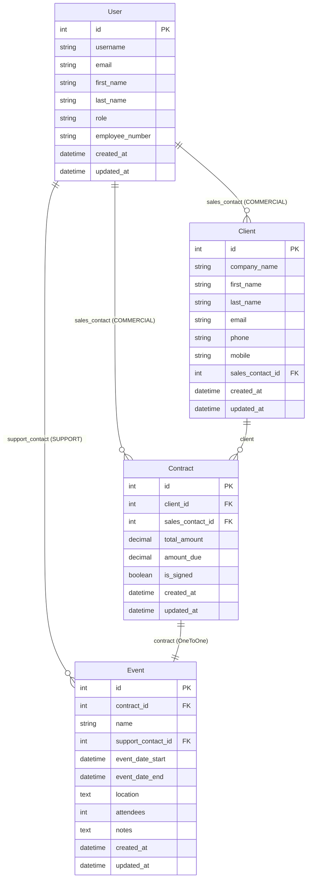

# OC_projet12 - Epic Events CRM

## Diagramme ERD (Entity-Relationship Diagram)



## Relations entre les modèles

### Description des relations
- **User → Client** : Un commercial peut avoir plusieurs clients (ForeignKey)
- **User → Contract** : Un commercial peut gérer plusieurs contrats (ForeignKey)
- **User → Event** : Un support peut gérer plusieurs événements (ForeignKey)
- **Client → Contract** : Un client peut avoir plusieurs contrats (ForeignKey)
- **Contract → Event** : Un contrat a un seul événement (OneToOneField)

### Rôles utilisateurs
- **COMMERCIAL** : Gère les clients et leurs contrats
- **SUPPORT** : Gère les événements
- **GESTION** : Accès complet (création d'utilisateurs, contrats, assignation supports)

### Workflow métier
```
Commercial → Crée Client
     ↓
Gestion → Crée Contrat (lié au Client + Commercial)
     ↓
Commercial → Crée Event (si contrat signé)
     ↓
Gestion → Assigne Support à l'Event
```

## Interface en ligne de commande (CLI)

### Authentification JWT

Le système utilise des tokens JWT pour l'authentification persistante. Les tokens sont stockés localement et permettent d'accéder aux fonctionnalités selon les permissions de l'utilisateur.

### Commandes disponibles

#### Authentification
```bash
# Se connecter
python epicevents.py login [username]
# ou
python epicevents.py login
# (vous serez invité à saisir username et password)

# Se déconnecter
python epicevents.py logout

# Vérifier le statut de la session
python epicevents.py status

# Informations sur l'utilisateur connecté
python epicevents.py whoami
```

#### Permissions
```bash
# Voir les permissions de l'utilisateur actuel
python epicevents.py permissions
```

#### Consultation des données (nécessitent une authentification)
```bash
# Lister tous les clients accessibles
python epicevents.py clients

# Lister tous les contrats accessibles
python epicevents.py contracts

# Lister tous les événements accessibles
python epicevents.py events

# Voir les détails d'un client spécifique
python epicevents.py client <id>

# Voir les détails d'un contrat spécifique
python epicevents.py contract <id>

# Voir les détails d'un événement spécifique
python epicevents.py event <id>
```

#### Utilitaires
```bash
# Debug du token JWT
python epicevents.py debug

# Supprimer un token corrompu
python epicevents.py clear

# Afficher l'aide
python epicevents.py help
```

### Exemples d'utilisation

```bash
# Connexion d'un commercial
python epicevents.py login marie_commercial
Mot de passe: ****
Connexion réussie pour marie_commercial
Utilisateur: Marie Martin
Rôle: Commercial
Numéro d'employé: EMP001

# Vérification des permissions
python epicevents.py permissions
Permissions pour marie_commercial (Commercial):
  - view_all_data
  - create_clients
  - update_own_clients
  - update_own_contracts
  - create_events

# Consultation des données
python epicevents.py clients
2 clients trouvés

Liste des clients:
--------------------------------------------------------------------------------
ID: 1
Entreprise: Tech Solutions SARL
Contact: Jean Dupont
Email: jean.dupont@techsolutions.fr
Commercial: Marie Martin
----------------------------------------
ID: 2
Entreprise: Innovate Corp
Contact: Sophie Leroy
Email: sophie.leroy@innovate.com
Commercial: Marie Martin
----------------------------------------

# Voir les détails d'un client
python epicevents.py client 1
Détails du client 1:
--------------------------------------------------
Entreprise: Tech Solutions SARL
Contact: Jean Dupont
Email: jean.dupont@techsolutions.fr
Téléphone: +33123456789
Mobile: +33612345678
Commercial: Marie Martin
Créé le: 2025-08-10 14:30:00

# Lister les contrats
python epicevents.py contracts
1 contrats trouvés

Liste des contrats:
--------------------------------------------------------------------------------
ID: 1
Client: Tech Solutions SARL
Commercial: Marie Martin
Montant total: 15000.00
Montant dû: 7500.00
Signé: Oui
----------------------------------------

# Lister les événements
python epicevents.py events
1 événements trouvés

Liste des événements:
--------------------------------------------------------------------------------
ID: 1
Nom: Conférence Tech 2025
Client: Tech Solutions SARL
Date début: 2025-09-15 09:00:00
Lieu: Centre de conférences Paris
Participants: 150
Support: Pierre Durand
----------------------------------------

# Statut de la session
python epicevents.py status
Utilisateur connecté: marie_commercial
Rôle: COMMERCIAL
Numéro d'employé: EMP001
Expiration: 2025-08-13 18:30:45
Session active

# Déconnexion
python epicevents.py logout
Déconnexion réussie
```

### Permissions par rôle

- **COMMERCIAL** : Création et gestion de clients, gestion de ses contrats, création d'événements
- **SUPPORT** : Gestion de ses événements assignés
- **GESTION** : Accès complet (utilisateurs, contrats, assignation de supports)

### Sécurité

- Tokens JWT avec expiration (8 heures par défaut)
- Stockage sécurisé local (fichier `~/.epicevents_token`)
- Permissions granulaires selon le rôle
- Gestion automatique de l'expiration des tokens