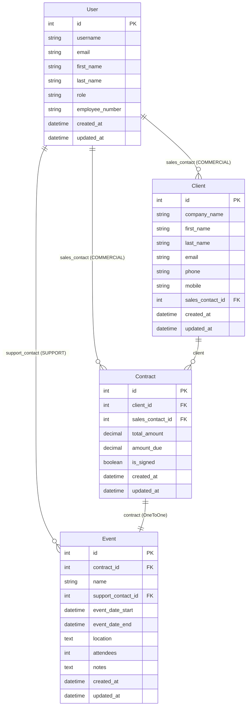

# OC_projet12 - Epic Events CRM

## Diagramme ERD (Entity-Relationship Diagram)



## Relations entre les modèles

### Description des relations
- **User → Client** : Un commercial peut avoir plusieurs clients (ForeignKey)
- **User → Contract** : Un commercial peut gérer plusieurs contrats (ForeignKey)
- **User → Event** : Un support peut gérer plusieurs événements (ForeignKey)
- **Client → Contract** : Un client peut avoir plusieurs contrats (ForeignKey)
- **Contract → Event** : Un contrat a un seul événement (OneToOneField)

### Rôles utilisateurs
- **COMMERCIAL** : Gère les clients et leurs contrats
- **SUPPORT** : Gère les événements
- **GESTION** : Accès complet (création d'utilisateurs, contrats, assignation supports)

### Workflow métier
```
Commercial → Crée Client
     ↓
Gestion → Crée Contrat (lié au Client + Commercial)
     ↓
Commercial → Crée Event (si contrat signé)
     ↓
Gestion → Assigne Support à l'Event
```